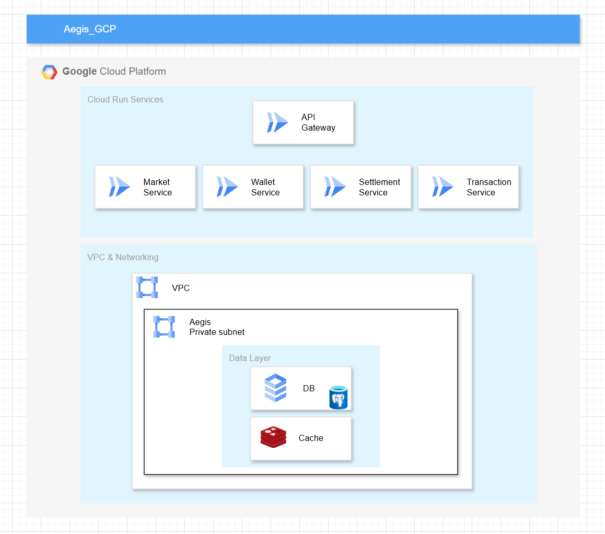
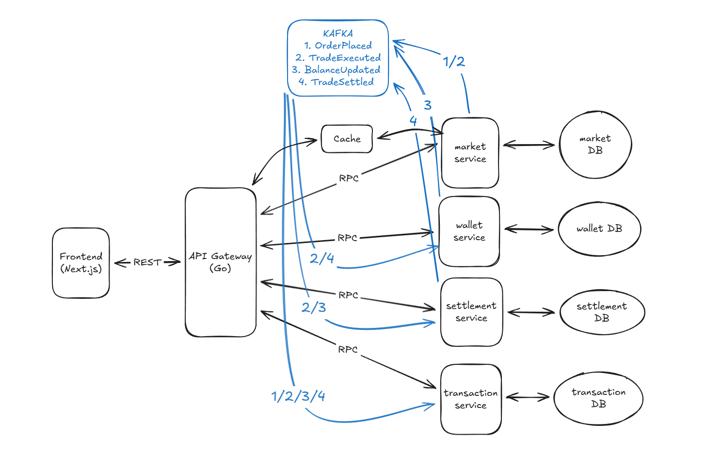

# Aegis Prediction Market Platform

A decentralized prediction market platform built with Go microservices architecture, enabling users to create, trade, and settle prediction markets on various topics.

## Overview

- Microservices: API Gateway, Market, Wallet, Settlement, Transaction
- Resilient gRPC clients: 1s timeouts, retries with jitter, circuit breaker, concurrent call limiting, Kafka fallback
- API Gateway: HTTP → gRPC bridge with Redis caching, singleflight, and ETag/Last-Modified support
- Shared libraries: `shared/grpc`, `shared/circuitbreaker`, `shared/retry`, `shared/kafka`
- Protocol buffers: service definitions under `proto/`
- Orchestration: `docker-compose.yml`
- See Scalability design in `README_SCALABILITY.md`
- See testing guides: `README_UNIT.md`, `README_INTEGRATION.md`, `README_BE_E2E.md`, `README_FE_E2E.md`, `README_COVERAGE.md`, and `tests/load/README.md`

## 🏗️ Architecture Overview

The Aegis platform follows a microservices architecture with the following services:

### Core Services

1. **API Gateway** (Port 8080)
   - Central entry point for all client requests
   - Routes requests to appropriate microservices
   - Handles load balancing and service discovery
   - Provides unified API interface

2. **Market Service**
   - Manages prediction markets and options
   - Handles market creation, updates, and queries
   - Integrates with Redis for real-time updates
   - Manages user accounts and authentication

3. **Wallet Service**
   - Handles all financial transactions
   - Manages user wallet accounts and balances
   - Processes deposits, withdrawals, and transfers
   - Supports USDC currency with decimal precision

4. **Settlement Service**
   - Manages market settlement and payout distribution
   - Calculates winning pools and user payouts
   - Handles settlement completion and distribution
   - Integrates with wallet service for payouts

5. **Transaction Service**
   - Legacy service for basic transaction processing
   - Handles transaction creation and management

### Infrastructure

- **PostgreSQL**: Primary database for services
- **Redis**: Caching and response acceleration in API Gateway
- **Kafka**: Asynchronous fallback and messaging
- **Docker Compose**: Local orchestration

## 🚀 Quick Start

### Prerequisites

- Go 1.22+
- Docker and Docker Compose
- PostgreSQL client tools (optional)

### Installation

1. **Clone the repository:**
   ```bash
   git clone <repository-url>
   cd Aegis
   ```

2. **Start all services with Docker Compose:**
   ```bash
   docker-compose up -d
   ```

3. **Wait for services to be ready:**
   ```bash
   ./test-system.sh
   ```

4. **Verify services are running:**
   ```bash
   curl http://localhost:8080/health
   ```

## 📋 API Documentation

### Base URL
All API requests should be made to the API Gateway:
```
http://localhost:8080/api/
```

### Authentication
Development includes a dev login endpoint; production authentication is gRPC-token capable.

#### MetaMask Nonce Verification (SIWE-style)

- Authenticate wallet ownership using a one-time nonce challenge signed in MetaMask.
- Store the latest nonce in `users.nonce` and rotate it after successful login to prevent replay.

Flow

1. Request a nonce challenge for a wallet address
   ```bash
   curl "http://localhost:8080/api/auth/nonce?address=0xYourWallet"
   # → {"nonce":"<random>","expires_at":"2025-01-01T00:00:00Z"}
   ```
2. Sign the nonce with MetaMask (`personal_sign`) on the client
   ```js
   const [address] = await ethereum.request({ method: 'eth_requestAccounts' })
   const res = await fetch(`/api/auth/nonce?address=${address}`)
   const { nonce } = await res.json()
   const message = `Aegis login\nNonce: ${nonce}`
   const signature = await ethereum.request({ method: 'personal_sign', params: [message, address] })
   ```
3. Submit the signature for verification
   ```bash
   curl -X POST http://localhost:8080/api/auth/login \
     -H "Content-Type: application/json" \
     -d '{
       "address": "0xYourWallet",
       "nonce": "<random>",
       "signature": "0xSignature"
     }'
   # → {"token":"<jwt-or-grpc-token>","user_id":"<uuid>"}
   ```

Server-side verification

- Recover signer from `signature` over the exact `message` and compare to `address`.
- Validate nonce is current, unexpired, and unused; then rotate to a new random value.
- Issue a short-lived JWT or gRPC auth token; include `user_id` and `role` claims.
- Prefer EIP-4361 (Sign-In with Ethereum) formatting for the message; use `personal_sign` (EIP-191), not `eth_sign`.
- Apply rate limiting and set a maximum nonce TTL (e.g., 5 minutes).

Notes

- The `users` table includes `nonce TEXT NOT NULL` which is used as the one-time challenge.
- In production, return tokens compatible with the API Gateway’s gRPC authentication.

### Endpoints

#### Users
- `POST /users` - Create a new user
- `GET /users/{id}` - Get user by ID
- `GET /users/wallet/{address}` - Get user by wallet address
- `PUT /users/{id}` - Update user information

#### Markets
- `POST /markets` - Create a new market
- `GET /markets/{id}` - Get market details
- `GET /markets` - List all markets
- `PUT /markets/{id}` - Update market information

#### Options
- `POST /options` - Create market option
- `GET /options/{id}` - Get option details
- `GET /options/market/{marketId}` - Get options for a market

#### Wallets
- `POST /wallets` - Create wallet account
- `GET /wallets/{accountId}` - Get wallet account
- `GET /wallets/user/{userId}` - Get wallet by user ID
- `PUT /wallets/{accountId}` - Update wallet account
- `POST /wallets/{accountId}/deposit` - Deposit funds
- `POST /wallets/{accountId}/withdrawal` - Withdraw funds
- `POST /wallets/{accountId}/debit` - Debit wallet
- `POST /wallets/{accountId}/credit` - Credit wallet
- `GET /wallets/{accountId}/transactions` - Get wallet transactions

#### Settlements
- `POST /settlements` - Create settlement
- `GET /settlements/{id}` - Get settlement
- `GET /settlements/market/{marketId}` - Get settlement by market
- `POST /settlements/{id}/complete` - Complete settlement

#### Transactions
- `GET /transactions/{id}` - Get transaction
- `POST /transactions/{id}/settle` - Settle transaction

### Example Usage

#### Create a User
```bash
curl -X POST http://localhost:8080/api/users \
  -H "Content-Type: application/json" \
  -d '{
    "wallet_address": "0x742d35Cc6634C0532925a3b844Bc9e7595f0bEb7",
    "balance": 1000.0,
    "role": "user"
  }'
```

#### Create a Market
```bash
curl -X POST http://localhost:8080/api/markets \
  -H "Content-Type: application/json" \
  -d '{
    "question": "Will Bitcoin price exceed $100,000 by end of 2024?",
    "description": "Bitcoin price prediction market",
    "category": "cryptocurrency",
    "end_time": "2024-12-31T23:59:59Z"
  }'
```

#### Create Wallet Account
```bash
curl -X POST http://localhost:8080/api/wallets \
  -H "Content-Type: application/json" \
  -d '{
    "user_id": "user-uuid",
    "currency": "USDC"
  }'
```

#### Deposit Funds
```bash
curl -X POST http://localhost:8080/api/wallets/{accountId}/deposit \
  -H "Content-Type: application/json" \
  -d '{
    "amount": 500.0,
    "reference_id": "deposit_001"
  }'
```

## 🧪 Testing

### Run System Tests
Execute the comprehensive test script:
```bash
./test-system.sh
```

This script will:
- Verify all services are running
- Test all API endpoints
- Validate service communication
- Check database connectivity

### Test Guides
- Unit tests: `README_UNIT.md`
- Integration tests: `README_INTEGRATION.md`
- Backend E2E: `README_BE_E2E.md`
- Frontend E2E: `README_FE_E2E.md`
- Coverage: `README_COVERAGE.md`
- Load testing: `tests/load/README.md`

### Individual Service Testing
Each service has its own health check endpoint:
```bash
# API Gateway
curl http://localhost:8080/health

# Market Service
curl http://localhost:8081/health

# Wallet Service
curl http://localhost:8082/health

# Settlement Service
curl http://localhost:8084/health
```

## 🗄️ Database Schema

### Users Table
```sql
CREATE TABLE users (
    id UUID PRIMARY KEY,
    wallet_address VARCHAR(255) NOT NULL UNIQUE,
    balance DECIMAL(20, 8) NOT NULL DEFAULT 0,
    nonce TEXT NOT NULL,
    role VARCHAR(50) NOT NULL DEFAULT 'user',
    created_at TIMESTAMP NOT NULL DEFAULT NOW(),
    updated_at TIMESTAMP NOT NULL DEFAULT NOW()
);
```

### Markets Table
```sql
CREATE TABLE markets (
    id UUID PRIMARY KEY,
    question TEXT NOT NULL,
    description TEXT,
    category VARCHAR(100),
    end_time TIMESTAMP NOT NULL,
    resolution_time TIMESTAMP,
    status VARCHAR(50) NOT NULL DEFAULT 'active',
    outcome VARCHAR(50),
    created_at TIMESTAMP NOT NULL DEFAULT NOW(),
    updated_at TIMESTAMP NOT NULL DEFAULT NOW()
);
```

### Wallet Accounts Table
```sql
CREATE TABLE wallet_accounts (
    id UUID PRIMARY KEY,
    user_id UUID NOT NULL,
    address VARCHAR(255) NOT NULL UNIQUE,
    currency VARCHAR(10) NOT NULL DEFAULT 'USDC',
    total_balance DECIMAL(20, 8) NOT NULL DEFAULT 0,
    available_balance DECIMAL(20, 8) NOT NULL DEFAULT 0,
    status VARCHAR(50) NOT NULL DEFAULT 'active',
    created_at TIMESTAMP NOT NULL DEFAULT NOW(),
    updated_at TIMESTAMP NOT NULL DEFAULT NOW()
);
```

### Settlements Table
```sql
CREATE TABLE settlements (
    id UUID PRIMARY KEY,
    market_id UUID NOT NULL,
    winning_option_id UUID NOT NULL,
    total_pool DECIMAL(20, 8) NOT NULL,
    winning_pool DECIMAL(20, 8) NOT NULL,
    status VARCHAR(50) NOT NULL DEFAULT 'pending',
    settled_at TIMESTAMP,
    created_at TIMESTAMP NOT NULL DEFAULT NOW(),
    updated_at TIMESTAMP NOT NULL DEFAULT NOW()
);
```

## 🔧 Configuration

### Environment Variables

API Gateway key environment variables:
- `MARKET_SERVICE_GRPC_ADDR`: gRPC address for Market service (e.g., `market-service:50051`)
- `WALLET_SERVICE_GRPC_ADDR`: gRPC address for Wallet service (e.g., `wallet-service:50052`)
- `SETTLEMENT_SERVICE_GRPC_ADDR`: gRPC address for Settlement service (e.g., `settlement-service:50053`)
- `TRANSACTION_SERVICE_GRPC_ADDR`: gRPC address for Transaction service (e.g., `transaction-service:50052`)
- `KAFKA_BROKERS`: comma-separated Kafka brokers (e.g., `kafka:29092`)
- `REDIS_URL`: Redis connection URL (e.g., `redis://redis:6379`)

## 🚢 Deployment

### Docker Compose Deployment (Local Development)
```bash
# Start all services
docker-compose up -d

# View logs
docker-compose logs -f

# Stop all services
docker-compose down
```

## 📈 Scalability

See `README_SCALABILITY.md` for the resilience patterns (timeouts, retries with jitter, circuit breaker, concurrent call limiting) and Kafka fallback design.
# Rebuild and restart
docker-compose down && docker-compose up --build -d
```

### Google Cloud Run Deployment (Production)

Deploy your Aegis microservices to Google Cloud Run using the provided Terraform configuration:

#### Prerequisites
- Google Cloud SDK installed and authenticated
- Terraform installed
- Container images pushed to Google Container Registry (GCR) or Artifact Registry

#### Quick Start
1. **Navigate to Terraform directory:**
   ```bash
   cd terraform
   ```

2. **Authenticate with GCP:**
   ```bash
   gcloud auth application-default login
   ```

3. **Initialize Terraform:**
   ```bash
   terraform init
   ```

4. **Deploy API Gateway:**
   ```bash
   terraform apply \
     -var 'project_id=my-gcp-project' \
    -var 'region=asia-southeast1' \
    -var 'service_name=api-gateway' \
    -var 'image=asia-southeast1-docker.pkg.dev/my-project/aegis/api-gateway:latest' \
     -var 'allow_unauthenticated=true' \
     -var 'cpu=1' \
     -var 'memory=512Mi' \
     -var 'concurrency=100' \
     -var 'env_vars={
       KAFKA_BROKERS="kafka:9092",
       CORS_ORIGINS="*",
       MARKET_SERVICE_URL="market-service:8081",
       WALLET_SERVICE_URL="wallet-service:8082",
       SETTLEMENT_SERVICE_URL="settlement-service:8084",
       TRANSACTION_SERVICE_URL="transaction-service:5555"
     }'
   ```

5. **Deploy other services** (repeat with appropriate service names and images):
   ```bash
   # Market Service
   terraform apply -var 'service_name=market-service' -var 'image=asia-southeast1-docker.pkg.dev/my-project/aegis/market-service:latest' -var 'env_vars={REDIS_HOST="redis:6379",DB_HOST="postgres:5432"}'
   
   # Wallet Service
   terraform apply -var 'service_name=wallet-service' -var 'image=asia-southeast1-docker.pkg.dev/my-project/aegis/wallet-service:latest' -var 'env_vars={DB_HOST="postgres:5432"}'
   
   # Settlement Service
   terraform apply -var 'service_name=settlement-service' -var 'image=asia-southeast1-docker.pkg.dev/my-project/aegis/settlement-service:latest' -var 'env_vars={DB_HOST="postgres:5432"}'
   ```

#### Configuration Options
- **CPU/Memory**: Adjust `cpu` (1, 2, 4) and `memory` (512Mi, 1Gi, 2Gi+)
- **Scaling**: Set `min_instances` and `max_instances` for autoscaling
- **Security**: Set `allow_unauthenticated=false` for private services
- **Networking**: Configure `vpc_connector` for VPC access
- **Environment Variables**: Pass service-specific configuration via `env_vars`

#### Production Considerations
- Use Artifact Registry for container images
- Configure Cloud SQL for PostgreSQL instead of containerized database
- Use Memorystore for Redis instead of containerized Redis
- Set up Cloud Monitoring and Logging
- Configure proper IAM roles and service accounts
- Use Cloud Load Balancer for custom domains and SSL

## CI Secrets (GitHub Actions)

- Required repository secrets for the build/push workflow:
  - `GCP_SA_KEY`: service account JSON with permissions to push images
  - `GCP_PROJECT_ID`: your GCP project ID
- Minimum roles for the CI service account:
  - `roles/artifactregistry.writer`
  - Optional (if deploying from CI): `roles/run.admin`
  - Optional (advanced caching): `roles/storage.admin`
- Where to set: Repository Settings → Security → Secrets and variables → Actions
- Forks: Secrets are not passed to workflows triggered from forks (including Dependabot). Trigger via `push` on this repo or `workflow_dispatch`. Our workflow validates the presence of secrets and fails fast with a clear message.
- Alternative: Use Workload Identity Federation. Replace `credentials_json` with `workload_identity_provider` and `service_account` in the auth step to avoid storing keys.

## Enable Required Google APIs

- Enable APIs once per project (owner/admin required). Terraform no longer enables Artifact Registry:
  - `gcloud services enable run.googleapis.com compute.googleapis.com sqladmin.googleapis.com redis.googleapis.com secretmanager.googleapis.com artifactregistry.googleapis.com`
- Or use the Cloud Console API pages to enable them.

### Individual Service Deployment
Each service can be deployed independently:
```bash
# Build service
cd market && go build ./cmd/main.go

# Run service
cd market && ./main
```

## 🔮 Future Enhancements

### Planned Features
- **Resolution Service**: External oracle integration for market resolution
- **Real-time Updates**: WebSocket support for live market data
- **Advanced Analytics**: Market analytics and user insights
- **Multi-chain Support**: Integration with multiple blockchain networks
- **Mobile App**: Native mobile applications
- **Advanced Trading**: Limit orders, stop-loss, and other trading features

### External Integrations
- **Fireblocks**: Institutional custody and wallet management
- **Chainlink**: Decentralized oracle network for market resolution
- **Sema**: Alternative oracle provider
- **Polygon**: Layer 2 scaling solution

## 🤝 Contributing

1. Fork the repository
2. Create a feature branch
3. Make your changes
4. Add tests for new functionality
5. Run the test suite
6. Submit a pull request

## 📄 License

This project is licensed under the MIT License - see the LICENSE file for details.

## 📞 Support

For support and questions:
- Create an issue in the GitHub repository
- Check the documentation and examples
- Review the test cases for usage patterns

---

**Aegis Prediction Market Platform** - Empowering decentralized prediction markets with robust microservices architecture.
## Proto Generation

- Pinned plugins: `protoc-gen-go v1.33.0`, `protoc-gen-go-grpc v1.3.0`
- Dockerized one-liner:
  - `make protos`
- Local (requires `protoc` and plugins installed):
  - `make protos-local`

Generated files are written to `proto/gen` with source-relative paths.

### Local setup (if not using Docker)

- Install prerequisites:
  - `brew install go protobuf`
  - `go install google.golang.org/protobuf/cmd/protoc-gen-go@v1.33.0`
  - `go install google.golang.org/grpc/cmd/protoc-gen-go-grpc@v1.3.0`
  - Ensure `~/go/bin` is on your `PATH`
- Generate:
  - `make protos-local`

### Notes

- Keep the generator versions pinned to avoid runtime incompatibilities
- Commit changes under `proto/gen` when proto definitions change

## Docker Compose

- The Compose `version:` field is obsolete and has been removed to silence warnings
- Use `docker compose up -d` and `docker compose build` as usual

## CORS Configuration

- Environment variables:
  - `CORS_ORIGINS`: comma-separated origins (default `http://localhost:3000,http://127.0.0.1:3000`)
  - `CORS_METHODS`: allowed methods (default `GET,POST,PUT,DELETE,OPTIONS`)
  - `CORS_HEADERS`: allowed headers (default `Accept,Content-Type,Authorization`)
- The API Gateway includes CORS middleware that:
  - Sets `Access-Control-Allow-Origin`, `Access-Control-Allow-Methods`, `Access-Control-Allow-Headers`
  - Handles preflight `OPTIONS` requests
  - Exposes `Content-Length` and supports credentials
- Quick tests:
  - Simple request: `curl -i http://localhost:8080/health -H 'Origin: http://localhost:3000'`
  - Preflight: `curl -i -X OPTIONS http://localhost:8080/api/markets -H 'Origin: http://localhost:3000' -H 'Access-Control-Request-Method: POST' -H 'Access-Control-Request-Headers: Content-Type, Authorization'`
## Kafka & Redis (Local Containers)

- Kafka runs as a single broker in KRaft mode; use the internal listener `kafka:29092`
- Redis runs without authentication for local development

- API Gateway reads brokers from `KAFKA_BROKERS` (comma-separated), default `kafka:29092`
- Services connect to Redis at `redis:6379`

- Quick checks:
  - Kafka: `docker exec -it aegis-kafka-1 bash -lc 'kafka-topics.sh --bootstrap-server kafka:29092 --list'`
  - Redis: `docker exec -it aegis-redis-1 redis-cli ping`

## ☁️ GCP Architecture

High-level view of how Aegis runs on GCP: traffic goes to the API Gateway, which calls Market, Wallet, Settlement, and Transaction services over gRPC, backed by Cloud SQL, Redis, and Kafka.

## 🌐 API Diagram

High-level view of HTTP → gRPC routing: `/api/markets`, `/api/wallets`, and `/api/settlements` terminate at the API Gateway, which maps each route to the corresponding gRPC method on the backend services.
